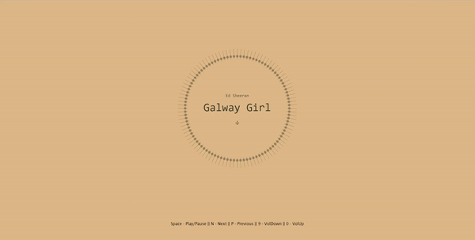

## Audiopop
-Simple sine wave based music visualization using HTML Web Audio API.

## Setup

Clone the repo and cd into the directory.

```
git clone https://github.com/jnpco/Audipop.git
cd Audiopop
```

### Demo


## Usage

*You must have node installed on your local machine.*

1. `npm install` to download node modules.
2. run `npm run dev`.

Not a complete solution for an app, but you can easily implement this to a complete one. Uses web audio api to process audio and calculate bar height.

